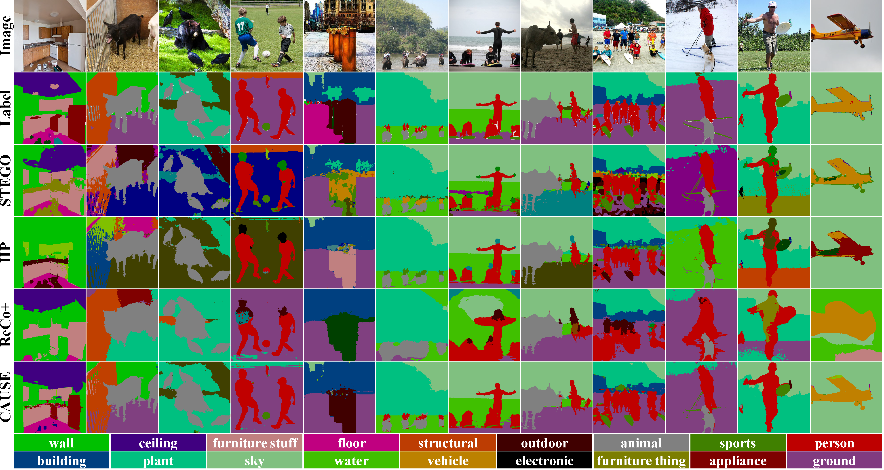
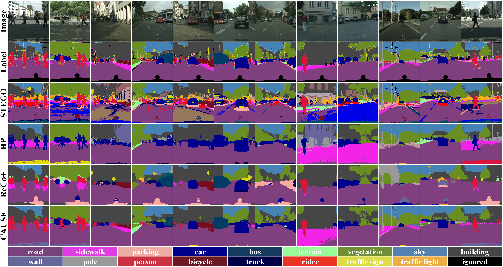
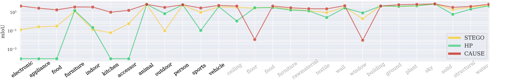

# ***Title: [Causal Unsupervised Semantic Segmentation](https://arxiv.org/pdf/2310.07379v1.pdf)***


[](https://paperswithcode.com/sota/unsupervised-semantic-segmentation-on-coco-7?p=causal-unsupervised-semantic-segmentation)

[](https://paperswithcode.com/sota/unsupervised-semantic-segmentation-on?p=causal-unsupervised-semantic-segmentation)

[](https://paperswithcode.com/sota/unsupervised-semantic-segmentation-on-coco-8?p=causal-unsupervised-semantic-segmentation)

[](https://paperswithcode.com/sota/unsupervised-semantic-segmentation-on-coco-6?p=causal-unsupervised-semantic-segmentation)


[](https://paperswithcode.com/sota/unsupervised-semantic-segmentation-on-pascal-1?p=causal-unsupervised-semantic-segmentation)

This is pytorch implementation code for realizing the technical part of *CAusal Unsupervised Semantic sEgmentation (CAUSE)* to improve performance of unsupervised semantic segmentation.
This code is further developed by two baseline codes of [HP: Leveraging Hidden Positives for Unsupervised Semantic Segmentation](https://github.com/hynnsk/HP) accepted in [CVPR 2023](https://openaccess.thecvf.com/content/CVPR2023/papers/Seong_Leveraging_Hidden_Positives_for_Unsupervised_Semantic_Segmentation_CVPR_2023_paper.pdf)
and [STEGO: Unsupervised Semantic Segmentation by Distilling Feature Correspondences](https://github.com/mhamilton723/STEGO) accepted in [ICLR 2022](https://iclr.cc/virtual/2022/poster/6068).


---

You can see the following bundle of images in Appendix.
Further, we explain concrete implementation beyond the description of the main paper.

<figure class="half">
<figcaption>
Figure 1. Visual comparison of USS for COCO-stuff. Note that, in contrast to
true labels, baseline frameworks fail to
achieve targeted level of granularity, while CAUSE successfully clusters person, sports, vehicle, etc.
</figcaption>


<figcaption>
Figure 2. Qualitative comparison of unsupervised semantic segmentation for Cityscapes.
</figcaption>


<figcaption>
Figure 3. Log scale of mIoU results for each categories in COCO-Stuff (Black: Thing / Gray: Stuff )
</figcaption>


<figure>


---

## 🚀 Download Visual Quality, Seg Head Parameter, and Concept ClusterBook of CAUSE

You can download the checkpoint files including CAUSE-trained parameters based on
[DINO](https://openaccess.thecvf.com/content/ICCV2021/papers/Caron_Emerging_Properties_in_Self-Supervised_Vision_Transformers_ICCV_2021_paper.pdf), [DINOv2](https://arxiv.org/pdf/2304.07193.pdf), [iBOT](https://openreview.net/pdf?id=ydopy-e6Dg), [MSN](https://www.ecva.net/papers/eccv_2022/papers_ECCV/papers/136910442.pdf), [MAE](https://openaccess.thecvf.com/content/CVPR2022/papers/He_Masked_Autoencoders_Are_Scalable_Vision_Learners_CVPR_2022_paper.pdf)
in self-supervised vision transformer framework.
If you want to download the pretrained models of DINO in various structures the following CAUSE uses,
you can download them in the following links:

* [DINO](https://github.com/facebookresearch/dino), ICCV 2021
* [DINOv2](https://github.com/facebookresearch/dinov2), ArXiv 2023
* [iBOT](https://github.com/bytedance/ibot), ICLR 2022
* [MSN](https://github.com/facebookresearch/msn), ECCV 2022
* [MAE](https://github.com/facebookresearch/mae), CVPR 2022

---


|   Dataset    | Method        | Baseline   | mIoU(%) | pAcc(%) |  Visual Quality                                         |                                           Seg Head Parameter | Concept ClusterBook |
|:------------|---------------|------------|:-------:|:-------:|:---------------------------------------------------------------------------------------------:|:----------------------------------------------------------------------------------------------:|:----------------------------------------------------------------------------------------------:|
|  COCO-Stuff  | DINO+**CAUSE-MLP** | ViT-S/8  |  27.9   |  66.8   |  [[link]](https://drive.google.com/file/d/1Z0Zj9JWJQQk6qeRctcdAk9MfyZQCwkvW/view?usp=drive_link)   | [[link]](https://drive.google.com/drive/folders/1ByLMYly-lLAa4vBQZ8Sv8nLSWBLPbev-?usp=drive_link) | [[link]](https://drive.google.com/drive/folders/14bq-B4Xj4V3Usl2b2SfobCOaap4lzIXl?usp=drive_link) |
|  COCO-Stuff  | DINO+**CAUSE-TR** | ViT-S/8   |  32.4   |  69.6   |  [[link]](https://drive.google.com/file/d/1x9LNwCiXtZel-fTh8TqtRgHmmmrIFPgg/view?usp=drive_link)   | [[link]](https://drive.google.com/drive/folders/1ByLMYly-lLAa4vBQZ8Sv8nLSWBLPbev-?usp=drive_link) | [[link]](https://drive.google.com/drive/folders/14bq-B4Xj4V3Usl2b2SfobCOaap4lzIXl?usp=drive_link) |
|  COCO-Stuff  | DINO+**CAUSE-MLP** | ViT-S/16 |  25.9   |  66.3   |  [[link]](https://drive.google.com/file/d/1wcMomwarw5gQ3sSSmQlZICtP4r3kZMN8/view?usp=drive_link)   | [[link]](https://drive.google.com/drive/folders/1PfOHDxWF_YcPVOApUSK-xHDUSY32domZ?usp=drive_link) | [[link]](https://drive.google.com/drive/folders/1GnVOgtOZdt8N7M6cudd5d59FqZAQDDG5?usp=drive_link)|
|  COCO-Stuff  | DINO+**CAUSE-TR** | ViT-S/16  |  33.1   |  70.4   |  [[link]](https://drive.google.com/file/d/198_-3BvN_GCI63_Mx4lEPCHl0L9Fk2p2/view?usp=drive_link)   | [[link]](https://drive.google.com/drive/folders/1PfOHDxWF_YcPVOApUSK-xHDUSY32domZ?usp=drive_link) |[[link]](https://drive.google.com/drive/folders/1GnVOgtOZdt8N7M6cudd5d59FqZAQDDG5?usp=drive_link) |
|  COCO-Stuff  | DINO+**CAUSE-MLP** | ViT-B/8  |  34.3   |  72.8   |  [[link]](https://drive.google.com/file/d/1fmUs3UOsWVhOXvcbxjG9c-VT2vEaVzte/view?usp=drive_link)   | [[link]](https://drive.google.com/drive/folders/1Og2U2ihbPBrxpAAeWuped_FH4u_ecb0P?usp=drive_link) |[[link]](https://drive.google.com/drive/folders/10bZecU1EzgOISoi0RkajqSR-ebfAWr_N?usp=drive_link) | 
|  COCO-Stuff  | DINO+**CAUSE-TR** | ViT-B/8   |  41.9   |  74.9   |  [[link]](https://drive.google.com/file/d/107jUAW4Y6xCMB7AgtgMIFcBitLMmQHaT/view?usp=drive_link)   | [[link]](https://drive.google.com/drive/folders/1Og2U2ihbPBrxpAAeWuped_FH4u_ecb0P?usp=drive_link) |[[link]](https://drive.google.com/drive/folders/10bZecU1EzgOISoi0RkajqSR-ebfAWr_N?usp=drive_link) |
|  COCO-Stuff  | DINOv2+**CAUSE-TR** | ViT-B/14|  45.3   |  78.0   |  [[link]](https://drive.google.com/file/d/1e_Mub-u1EJOqzI7umk4BGgFApWukixmb/view?usp=drive_link)   | [[link]](https://drive.google.com/drive/folders/1CWMussJAvGulg94lUrNn3EooILbtgIOb?usp=drive_link) |[[link]](https://drive.google.com/drive/folders/1nBjBJnucRiBYFiJHeOJUuE5e1YSoYKaf?usp=drive_link) |
|  COCO-Stuff  | iBOT+**CAUSE-TR** | ViT-B/16  |  39.5   |  73.8   |  [[link]](https://drive.google.com/file/d/1px6M068h3TH4wAxhH9sHSKrMZqreL9z2/view?usp=drive_link)   | [[link]](https://drive.google.com/drive/folders/1BAMopzQNU7cmiaCyFv73SBLj2F6gikuU?usp=drive_link) |[[link]](https://drive.google.com/drive/folders/1mbJdzpOrR-sjmAk0O1hnqzsStXDU3CL9?usp=drive_link) |
|  COCO-Stuff  | MSN+**CAUSE-TR** | ViT-S/16   |  34.1   |  72.1   |  [[link]](https://drive.google.com/file/d/1R9KH3q9SxyitMzDGoKYQK4GkxuFMn7HQ/view?usp=drive_link)   | [[link]](https://drive.google.com/drive/folders/15F2aaVMbG40ISSXTL0f_UrVkX3UAFwZw?usp=drive_link) |[[link]](https://drive.google.com/drive/folders/19Mv7_5sM6e48eH80bAZSagXhO9CfEbCS?usp=drive_link) |
|  COCO-Stuff  | MAE+**CAUSE-TR** | ViT-B/16   |  21.5   |  59.1   |  [[link]](https://drive.google.com/file/d/1_vwGG51DN5rJliDKUcc-9DKLbklroJw9/view?usp=drive_link)   | [[link]](https://drive.google.com/drive/folders/1ubUbmSliqrN19v6Abqsb_djtWDbx9qbV?usp=drive_link) |[[link]](https://drive.google.com/drive/folders/1G91qCJx-Z3IpYFYLFAUyG1zqMMZOhQWx?usp=drive_link) |


---

|   Dataset    | Method        | Baseline   | mIoU(%) | pAcc(%) |  Visual Quality                                         |                                          Seg Head Parameter | Concept ClusterBook                                           |
|:------------|---------------|------------|:-------:|:-------:|:---------------------------------------------------------------------------------------------:|:----------------------------------------------------------------------------------------------:|:----------------------------------------------------------------------------------------------:|
|  Cityscapes  | DINO+**CAUSE-MLP** | ViT-S/8   |  21.7   |  87.7   | [[link]](https://drive.google.com/file/d/1sC7OltZGfXCCyPhEaHJ596mczBUMGiEr/view?usp=drive_link)  | [[link]](https://drive.google.com/drive/folders/1MT_HPyZvn09jEsvnlGci9ZLDB2e6h4PI?usp=drive_link) | [[link]](https://drive.google.com/drive/folders/1-ZfobyjlUGx5nltnBnjSzKzLQLTqcD_r?usp=drive_link) |
|  Cityscapes  | DINO+**CAUSE-TR** | ViT-S/8    |  24.6   |  89.4   | [[link]](https://drive.google.com/file/d/1HEk9DSFHV0i-9SNqCDtmKhQUcPhSsu2P/view?usp=drive_link)  | [[link]](https://drive.google.com/drive/folders/1MT_HPyZvn09jEsvnlGci9ZLDB2e6h4PI?usp=drive_link) | [[link]](https://drive.google.com/drive/folders/1-ZfobyjlUGx5nltnBnjSzKzLQLTqcD_r?usp=drive_link) |
|  Cityscapes  | DINO+**CAUSE-MLP** | ViT-B/8   |  25.7   |  90.3   | [[link]](https://drive.google.com/file/d/1T4urliZtG-mJgjr1k-AczlC7c6EmWovP/view?usp=drive_link)  | [[link]](https://drive.google.com/drive/folders/1Y7K3v_IUUn82rq5df6cQUagL_sNLZRdT?usp=drive_link) | [[link]](https://drive.google.com/drive/folders/1EoidRFHOT1w8LFNt2ws7C1BCkYdI4fw1?usp=drive_link) |
|  Cityscapes  | DINO+**CAUSE-TR** | ViT-B/8    |  28.0   |  90.8   | [[link]](https://drive.google.com/file/d/1hQUT8jmzj9StBF_3QN87SL2_HO5n9yxp/view?usp=drive_link)  | [[link]](https://drive.google.com/drive/folders/1Y7K3v_IUUn82rq5df6cQUagL_sNLZRdT?usp=drive_link) | [[link]](https://drive.google.com/drive/folders/1EoidRFHOT1w8LFNt2ws7C1BCkYdI4fw1?usp=drive_link) |
|  Cityscapes  | DINOv2+**CAUSE-TR** | ViT-B/14 |  29.9   |  89.8   | [[link]](https://drive.google.com/file/d/1SUKv38yrayooAVsW2VWLbg6iy64syWnV/view?usp=drive_link)  | [[link]](https://drive.google.com/drive/folders/1fi_DvMD3CLaZEozEgrGhIh6nH7WFq_Sj?usp=drive_link) | [[link]](https://drive.google.com/drive/folders/1t66yv8_otlAMwy-QQyff-6fiwP58kCvV?usp=drive_link) |
|  Cityscapes  | iBOT+**CAUSE-TR** | ViT-B/16   |  23.0   |  89.1   | [[link]](https://drive.google.com/file/d/1ZDCr0k6WdmjWFw6J-S7Y6HFf88tGfEAO/view?usp=drive_link)  | [[link]](https://drive.google.com/drive/folders/1T9OqBTc9tw9h3zDzzi137l8ls29_uOrd?usp=drive_link) | [[link]](https://drive.google.com/drive/folders/1t4qsGMYlIWoArvkAFr-uUerkwQYPR5u7?usp=drive_link) |
|  Cityscapes  | MSN+**CAUSE-TR** | ViT-S/16    |  21.2   |  89.1   | [[link]](https://drive.google.com/file/d/1-jSkmwRObBKOHdiMuu3eLaXWgQFMeida/view?usp=drive_link)  | [[link]](https://drive.google.com/drive/folders/1UQnhVADQvbnQKLjIXzEpY_hW76Yeeuuj?usp=drive_link) | [[link]](https://drive.google.com/drive/folders/1TLGaZjljYoVCFp4EjjOghtvczk-SzVR1?usp=drive_link) |
|  Cityscapes  | MAE+**CAUSE-TR** | ViT-B/16    |  12.5   |  82.0   | [[link]](https://drive.google.com/file/d/1241UvEi0zc5JS88fga2rZCS4wkDuaE3c/view?usp=drive_link)  | [[link]](https://drive.google.com/drive/folders/1Ng9mVhzAipmY5aPzJkX35flqJIQ8rgIp?usp=drive_link) | [[link]](https://drive.google.com/drive/folders/1SFYWWo5Khqoy8fIhvxuL2XoZEaKt1UH-?usp=drive_link) |


---

|   Dataset    | Method        | Baseline   | mIoU(%) | pAcc(%) |  Visual Quality                                         |                                          Seg Head Parameter  | Concept ClusterBook                                        |
|:------------|---------------|------------|:-------:|:-------:|:---------------------------------------------------------------------------------------------:|:----------------------------------------------------------------------------------------------:|:----------------------------------------------------------------------------------------------:|
|  Pascal VOC  | DINO+**CAUSE-MLP** | ViT-S/8    |  46.0   |  -      |  [[link]](https://drive.google.com/file/d/1nzZMGCqb7mYdSXN59xzMkQUitzjxJt-9/view?usp=drive_link)   | [[link]](https://drive.google.com/drive/folders/1o6AkLzqC1J-V4YB_S7BBhfGd2E6qdopO?usp=drive_link) | [[link]](https://drive.google.com/drive/folders/1H9dvIDaEW1fsIKsI1HPETD4NC2dj6Z6S?usp=drive_link) |
|  Pascal VOC  | DINO+**CAUSE-TR**  | ViT-S/8    |  50.0   |  -      |  [[link]](https://drive.google.com/file/d/1Q-2ey069mDHnziGlP1olEc-JSHBf7t6N/view?usp=drive_link)   | [[link]](https://drive.google.com/drive/folders/1o6AkLzqC1J-V4YB_S7BBhfGd2E6qdopO?usp=drive_link) | [[link]](https://drive.google.com/drive/folders/1H9dvIDaEW1fsIKsI1HPETD4NC2dj6Z6S?usp=drive_link) |
|  Pascal VOC  | DINO+**CAUSE-MLP** | ViT-B/8    |  47.9   |  -      |  [[link]](https://drive.google.com/file/d/1EWlKNbcWGSNXBhZpdezv3ghCcxItR-Zj/view?usp=drive_link)   | [[link]](https://drive.google.com/drive/folders/1sPlG9jQ-DljVguPNPDS1g3xnW_rTtUyw?usp=drive_link) | [[link]](https://drive.google.com/drive/folders/1zsTx1NOECcJ7DH1wa654wRH_NLV6FHWP?usp=drive_link) |
|  Pascal VOC  | DINO+**CAUSE-TR**  | ViT-B/8    |  53.3   |  -      |  [[link]](https://drive.google.com/file/d/1pqJNoCpCz3wMMjIMxQJ-WOxtdwvsaJWM/view?usp=drive_link)   | [[link]](https://drive.google.com/drive/folders/1sPlG9jQ-DljVguPNPDS1g3xnW_rTtUyw?usp=drive_link) | [[link]](https://drive.google.com/drive/folders/1zsTx1NOECcJ7DH1wa654wRH_NLV6FHWP?usp=drive_link) |
|  Pascal VOC  | DINOv2+**CAUSE-TR** | ViT-B/14  |  53.2   |  91.5   |  [[link]](https://drive.google.com/file/d/17FBfHfyML6jyeY5NvPJXUDI_vaxC87vk/view?usp=drive_link)   | [[link]](https://drive.google.com/drive/folders/1qsuKMVvpqsaYcVvZj3rDecmhZBAHOTeK?usp=drive_link) | [[link]](https://drive.google.com/drive/folders/1aGs3KSExQrdQytVFWigOGRs2yC3YLO12?usp=drive_link) |
|  Pascal VOC  | iBOT+**CAUSE-TR** | ViT-B/16    |  53.4   |  89.6   |  [[link]](https://drive.google.com/file/d/1UjkvZ0MFxL-P0kaeUQKSGnVrjPsaeHaY/view?usp=drive_link)   | [[link]](https://drive.google.com/drive/folders/1G9zvKcLNbhAyqKlJXUpt80CR6MBtuSdi?usp=drive_link) | [[link]](https://drive.google.com/drive/folders/1zA9d5eo41GerRWuBOnHY6_AjhtjGETCy?usp=drive_link) |
|  Pascal VOC  | MSN+**CAUSE-TR** | ViT-S/16     |  30.2   |  84.2   |  [[link]](https://drive.google.com/file/d/1by4USHNiEzem17s7jWKKUZTfUylQWyIy/view?usp=drive_link)   | [[link]](https://drive.google.com/drive/folders/1s6nzSmzt_ZTt_tCDvf8vmhU2RmE3Cdy0?usp=drive_link) | [[link]](https://drive.google.com/drive/folders/1bwLogZo3vJOJrpSanRpgZ_1WHTeB3e4q?usp=drive_link) |
|  Pascal VOC  | MAE+**CAUSE-TR** | ViT-B/16     |  25.8   |  83.7   |  [[link]](https://drive.google.com/file/d/1odjO5dgTTdmsWGuGG7xFPi3ZLsV6-stl/view?usp=drive_link)   | [[link]](https://drive.google.com/drive/folders/1Re_f8QgIdXDnrNwP_5g-kFL-6SoE9YPU?usp=drive_link) | [[link]](https://drive.google.com/drive/folders/1wOVWzTnfH58My8PT8rXW0sw2oVdc4xkL?usp=drive_link) |


---

|   Dataset    | Method        | Baseline   | mIoU(%) | pAcc(%) |  Visual Quality                                         |                                          Seg Head Parameter | Concept ClusterBook                                         |
|:------------|---------------|------------|:-------:|:-------:|:---------------------------------------------------------------------------------------------:|:----------------------------------------------------------------------------------------------:|:----------------------------------------------------------------------------------------------:|
|  COCO-81   | DINO+**CAUSE-MLP**  | ViT-S/8   |  19.1   |  78.8   | [[link]](https://drive.google.com/file/d/1Glxb7DHHhjxPQjkGygQM2prak7oH8dTt/view?usp=drive_link)  | [[link]](https://drive.google.com/drive/folders/1SlQ1_3phGBvjaxizjcYD92Nglab7RV6k?usp=drive_link) | [[link]](https://drive.google.com/drive/folders/1ON5vDLS_Wc5OGgTxVK_yFopQGHbKaOar?usp=drive_link) |
|  COCO-81   | DINO+**CAUSE-TR**   | ViT-S/8   |  21.2   |  75.2   | [[link]](https://drive.google.com/file/d/1QJmkV57mhKx6_A0E-yQcrQifX8lMRspO/view?usp=drive_link)  | [[link]](https://drive.google.com/drive/folders/1SlQ1_3phGBvjaxizjcYD92Nglab7RV6k?usp=drive_link) | [[link]](https://drive.google.com/drive/folders/1ON5vDLS_Wc5OGgTxVK_yFopQGHbKaOar?usp=drive_link) |
|  COCO-171  | DINO+**CAUSE-MLP** | ViT-S/8    |  10.6   |  44.9   | [[link]](https://drive.google.com/file/d/1EUDqFTHVlr2c8cIR9oTbjpS83Js6RW66/view?usp=drive_link)  | [[link]](https://drive.google.com/drive/folders/1SlQ1_3phGBvjaxizjcYD92Nglab7RV6k?usp=drive_link) | [[link]](https://drive.google.com/drive/folders/1ON5vDLS_Wc5OGgTxVK_yFopQGHbKaOar?usp=drive_link) |
|  COCO-171  | DINO+**CAUSE-TR**  | ViT-S/8    |  15.2   |  46.6   | [[link]](https://drive.google.com/file/d/1Gv6306XUb-rbWB980O5m5vxQeZKIModT/view?usp=drive_link)  | [[link]](https://drive.google.com/drive/folders/1SlQ1_3phGBvjaxizjcYD92Nglab7RV6k?usp=drive_link) | [[link]](https://drive.google.com/drive/folders/1ON5vDLS_Wc5OGgTxVK_yFopQGHbKaOar?usp=drive_link) |


---

## 🤖 CAUSE Framework (Top-Level File Directory Layout) 
    .
    ├── loader
    │   ├── netloader.py                # Self-Supervised Pretrained Model Loader & Segmentation Head Loader
    │   └── dataloader.py               # Dataloader Thanks to STEGO [ICLR 2022]
    │
    ├── models                          # Model Design of Self-Supervised Pretrained: [DINO/DINOv2/iBOT/MAE/MSN]
    │   ├── dinomaevit.py               # ViT Structure of DINO and MAE
    │   ├── dinov2vit.py                # ViT Structure of DINOv2
    │   ├── ibotvit.py                  # ViT Structure of iBOT
    │   └── msnvit.py                   # ViT Structure of MSN
    │
    ├── modules                         # Segmentation Head and Its Necessary Function
    │   └── segment_module.py           # [Including Tools with Generating Concept Book and Contrastive Learning
    │   └── segment.py                  # [MLP & TR] Including Tools with Generating Concept Book and Contrastive Learning
    │
    ├── utils
    │   └── utils.py                    # Utility for auxiliary tools
    │
    ├── train_modularity.py             # (STEP 1) [MLP & TR] Generating Concept Cluster Book as a Mediator
    │
    ├── train_front_door_mlp.py         # (STEP 2) [MLP] Frontdoor Adjustment through Unsupervised Semantic Segmentation
    ├── fine_tuning_mlp.py              # (STEP 3) [MLP] Fine-Tuning Cluster Probe
    │
    ├── train_front_door_tr.py          # (STEP 2) [TR] Frontdoor Adjustment through Unsupervised Semantic Segmentation
    ├── fine_tuning_tr.py               # (STEP 3) [TR] Fine-Tuning Cluster Probe
    │
    ├── test_mlp.py                     # [MLP] Evaluating Unsupervised Semantic Segmantation Performance (Post-Processing)
    ├── test_tr.py                      # [TR] Evaluating Unsupervised Semantic Segmantation Performance (Post-Processing)
    │
    ├── requirements.txt
    └── README.md


---
## 📊 How to Run CAUSE?


For the first, we should generate the cropped dataset by following [STEGO](https://github.com/mhamilton723/STEGO) in ICLR 2022.


```shell script
python crop_dataset.py --dataset "cocostuff27" --crop_type "five"
python crop_dataset.py --dataset "cityscapes"  --crop_type "five"
python crop_dataset.py --dataset "pascalvoc"   --crop_type "super"
python crop_dataset.py --dataset "cooc81"      --crop_type "double"
python crop_dataset.py --dataset "cooc171"     --crop_type "double"
```

And then,

```shell bash
bash run # All of the following three steps integrated
```

In this shell script file, you can see the following code

```shell script
#!/bin/bash
######################################
# [OPTION] DATASET
# cocostuff27
dataset="cocostuff27"
#############

######################################
# [OPTION] STRUCTURE
structure="TR"
######################################

######################################
# [OPTION] Self-Supervised Method
ckpt="checkpoint/dino_vit_base_8.pth"
######################################

######################################
# GPU and PORT
if [ "$structure" = "MLP" ]
then
    train_gpu="0,1,2,3"
elif [ "$structure" = "TR" ]
then
    train_gpu="4,5,6,7"
fi

# Non-Changeable Variable
test_gpu="${train_gpu:0}"
port=$(($RANDOM%800+1200))
######################################

######################################
# [STEP1] MEDIATOR
python train_mediator.py --dataset $dataset --ckpt $ckpt --gpu $train_gpu --port $port
######################################

######################################
# [STEP2] CAUSE
if [ "$structure" = "MLP" ]
then 
    python train_front_door_mlp.py --dataset $dataset --ckpt $ckpt --gpu $train_gpu --port $port
    python fine_tuning_mlp.py --dataset $dataset --ckpt $ckpt --gpu $train_gpu --port $port
elif [ "$structure" = "TR" ]
then
    python train_front_door_tr.py --dataset $dataset --ckpt $ckpt --gpu $train_gpu --port $port 
    python fine_tuning_tr.py --dataset $dataset --ckpt $ckpt --gpu $train_gpu --port $port
fi
######################################

######################################
# TEST
if [ "$structure" = "MLP" ]
then 
    python test_mlp.py --dataset $dataset --ckpt $ckpt --gpu $test_gpu
elif [ "$structure" = "TR" ]
then 
    python test_tr.py --dataset $dataset --ckpt $ckpt --gpu $test_gpu
fi
######################################
```


### 1. Training CAUSE

### (STEP 1): Generating Mediator based on Modularity

```shell script
python train_mediator.py # DINO/DINOv2/iBOT/MSN/MAE
```

### (STEP 2): Frontdoor Adjustment through Contrastive Learning

```shell script
python train_front_door_mlp.py # CAUSE-MLP

# or

python train_front_door_tr.py # CAUSE-TR
```


### (STEP 3):  *Technical STEP: Fine-Tuning Cluster Probe*

```shell script
python fine_tuning_mlp.py # CAUSE-MLP

# or

python fine_tuning_tr.py # CAUSE-TR
```

---

### 2. Testing CAUSE

```shell script
python test_mlp.py # CAUSE-MLP

# or

python test_tr.py # CAUSE-TR
```

---


## 💡 Environment Settings

* Creating Virtual Environment by Anaconda
> conda create -y -n neurips python=3.9

* Installing [PyTorch]((https://pytorch.org/)) Package in Virtual Envrionment
> pip3 install torch torchvision torchaudio --index-url https://download.pytorch.org/whl/cu118

* Installing Pip Package
> pip install -r requirements.txt

* [Optional] Removing Conda and PIP Cache if Conda and PIP have been locked by unknown reasons
> conda clean -a && pip cache purge

---

## 🍅 Download Datasets
### Available Datasets
* [COCO-Stuff](https://paperswithcode.com/dataset/coco-stuff)
* [Cityscapes](https://paperswithcode.com/dataset/cityscapes)
* [Pascal VOC](http://host.robots.ox.ac.uk/pascal/VOC/voc2012/index.html)

*Note: Pascal VOC is not necessary to download because dataloader will automatically download in your own dataset path*

### Try the following scripts
> * wget https://marhamilresearch4.blob.core.windows.net/stego-public/pytorch_data/cityscapes.zip
> * wget https://marhamilresearch4.blob.core.windows.net/stego-public/pytorch_data/cocostuff.zip

### If the above do not work, then download [azcopy](https://learn.microsoft.com/en-us/azure/storage/common/storage-use-azcopy-v10?toc=%2Fazure%2Fstorage%2Fblobs%2Ftoc.json&bc=%2Fazure%2Fstorage%2Fblobs%2Fbreadcrumb%2Ftoc.json) and follow the below scripts
> * azcopy copy "https://marhamilresearch4.blob.core.windows.net/stego-public/pytorch_data/cityscapes.zip" "custom_path" --recursive
> * azcopy copy "https://marhamilresearch4.blob.core.windows.net/stego-public/pytorch_data/cocostuff.zip" "custom_path" --recursive


### Unzip Datasets

```shell script
unzip cocostuff.zip && unzip cityscapes.zip
```

---
